# 👋 Hi, I'm Aditya Hegde

  
  
  

  <b>ML Engineer | Computer Vision | ML Infrastructure | Applied AI</b> 
  MS Artificial Intelligence @ San Jose State University (4.0 GPA)

---

## 🚀 About Me

* 🧠 I build **production-scale ML systems**, not just notebooks
* 🛰️ Specialized in **Computer Vision + Geospatial AI**
* ⚙️ Focused on **GPU inference pipelines, backend ML systems, and performance engineering**
* 📉 Reduced inference latency from **7 min → <1 min** in production
* 📈 Improved model performance by **+40% mAP** through systematic iteration
* 🏗️ Designed systems processing **15B+ pixels**

---

# 🧰 Tech Stack

### 🧠 Machine Learning

### ⚙️ Backend & Systems

### ☁️ Cloud & DevOps

### 💻 Languages

---

# 📊 GitHub Analytics

  

  
  

  

# 🏗️ Featured Engineering Work

### 🛰️ Geospatial ML Inference Pipeline

* Event-driven ingestion for high-resolution satellite imagery
* Hybrid C# + Python preprocessing
* Parallel GPU worker architecture
* Structured logging + runtime memory guards
* 15B+ pixels stress tested
* <1 min inference per 10,000 km²

### 🌊 Marine Debris Detector

* 1000+ satellite images processed
* > 90% validation accuracy
* +15% precision over baseline
* Dockerized deployment
* GIS-compatible vector output

### 🧠 Denoising Autoencoder

* Custom lightweight CNN
* 35+ PSNR
* 0.95+ SSIM
* Sub-30ms inference
* Led 12-engineer team

---

## 📚 Publications

- **Machine Learning-Based Space Risk Management** (IEEE ICEPES 2024)  
  https://ieeexplore.ieee.org/document/10653497

- **Deep Learning Based Dementia Detection on MRI Data** (Springer ICETSS 2024)  
  https://link.springer.com/chapter/10.1007/978-3-032-11488-4_15

---

# 🎯 Current Focus

* Scaling ML inference systems
* Performance-aware model architecture
* Distributed training optimization
* ML backend system design
* Applied Computer Vision in production environments

---

# 🤝 Let's Connect

  
  
  

